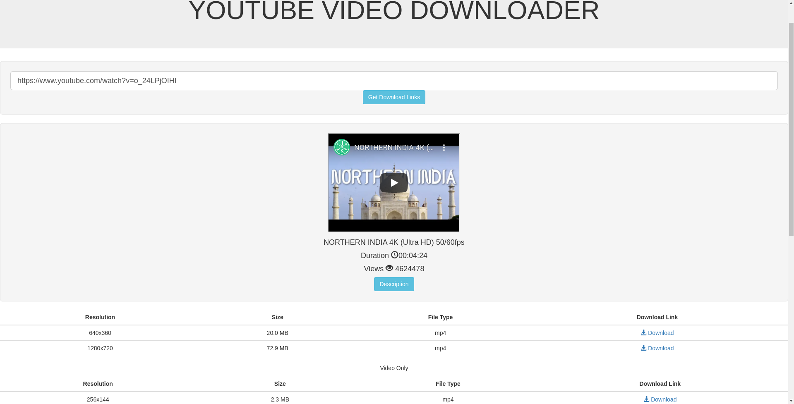

# Youtube Video Downloader

- Clone the project.
- Go to root project directory
- Run command `pip install -r requirements.txt`
- Set `YOUTUBE_DATA_API_KEY` in your environment (see https://pythonhosted.org/pafy/#api-keys and https://developers.google.com/youtube/v3/getting-started). This ensures that you don't hit quota limit(which causes Server Error 500) when using the default key provided by `pafy`.
- Run command `python manage.py runserver`

Built on top of django using [pafy](https://github.com/mps-youtube/pafy) and [youtube-dl](https://github.com/ytdl-org/youtube-dl).

## FAQ
### Server Error 500
- This is usually caused by outdated `youtube-dl`. Update `youtube-dl` using command `pip install --upgrade youtube-dl` and try again. 
### Video plays in the browser
- Right click on the download link and click on `Save link as` to save the video.

## Screenshot
 
